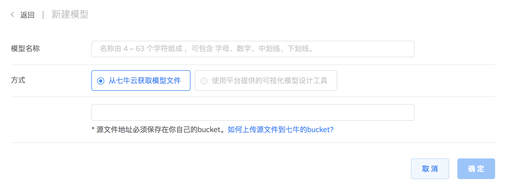
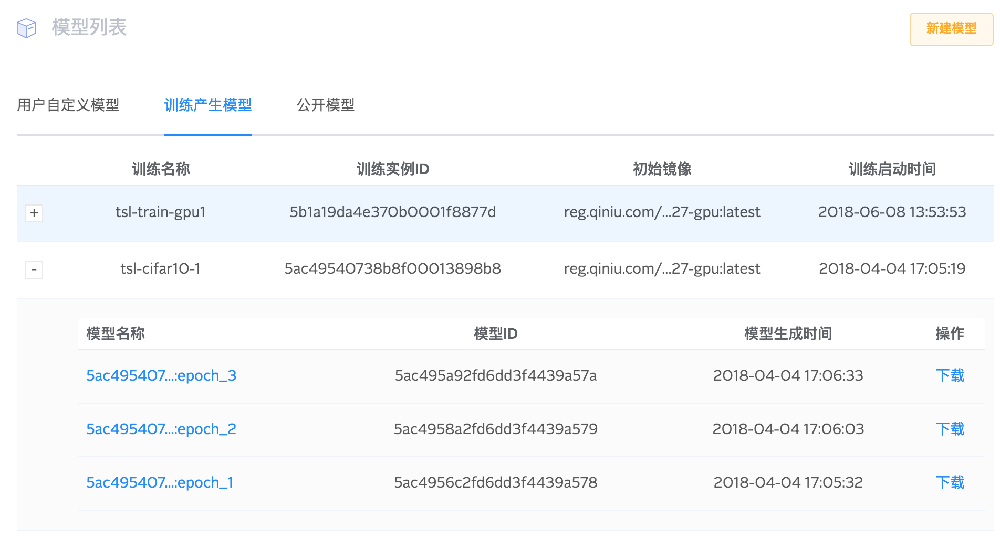
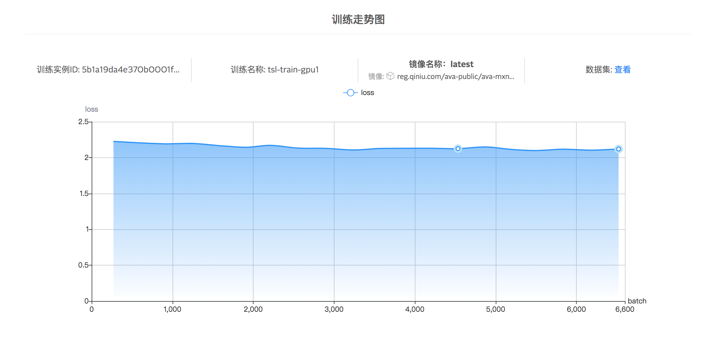

# 模型管理

AVA 平台提供了管理训练模型的能力. 用户可以查看并使用自定义模型, 训练产生的模型, 和公开模型. 后续的评估过程，可以量化模型在评估数据集上的表现. 也可以使用即将上线的应用发布功能, 将这些模型包装成应用服务, 提供在线分类/检测等功能.

## 自定义模型

用户可以将七牛云存储中的模型文件添加至自定义模型列表中.



## 训练产生模型

执行训练时, 可以借助 AVA SDK 将训练中间模型 snapshot 上传至七牛云存储, 这些模型可以在 "训练产生模型" 标签页查看, 每次训练可以保存多个 snapshot:



也可以查看当前 snapshot 训练中的指标走势, 如损失率:



要实现自动保存模型 snapshot, 用户只需在执行训练时, 设置对应 SDK 回调函数即可, 例如使用 MXNet 时:

```python
import mxnet as mx

from ava.train import base as train
from common import fit


def main():
    # 初始化 AVA 平台上的训练实例
    train_ins = train.TrainInstance()

    epoch_end_cb = [
        # mxnet default epoch callback
        mx.callback.do_checkpoint(
            snapshot_prefix, snapshot_interval_epochs),
        # ava-sdk 提供的 epoch callback
        train_ins.get_epoch_end_callback(
            "mxnet", batch_of_epoch=batch_of_epoch,
            epoch_interval=snapshot_interval_epochs)
    ]

    fit.fit(args, sym, data.get_rec_iter, 
    ...
    epoch_end_callback=epoch_end_cb)

```

详细引用方式请参阅 AVA SDK 示例

## 公开模型

AVA 中也可以查看平台提供的公开模型:
